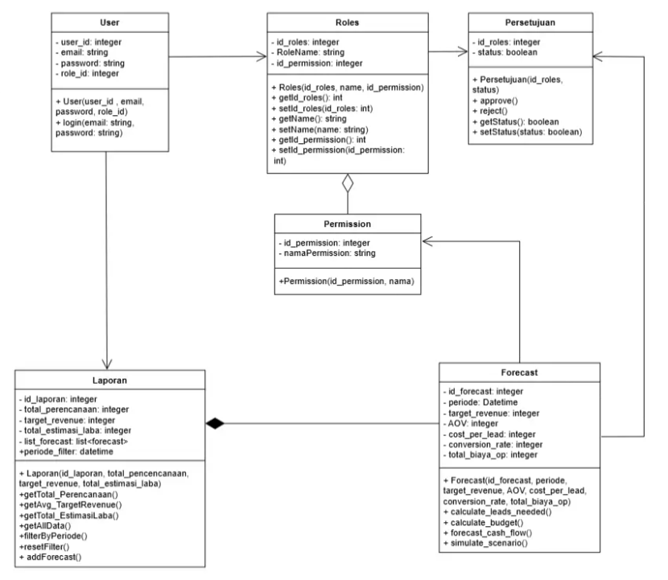
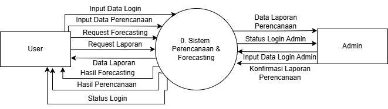
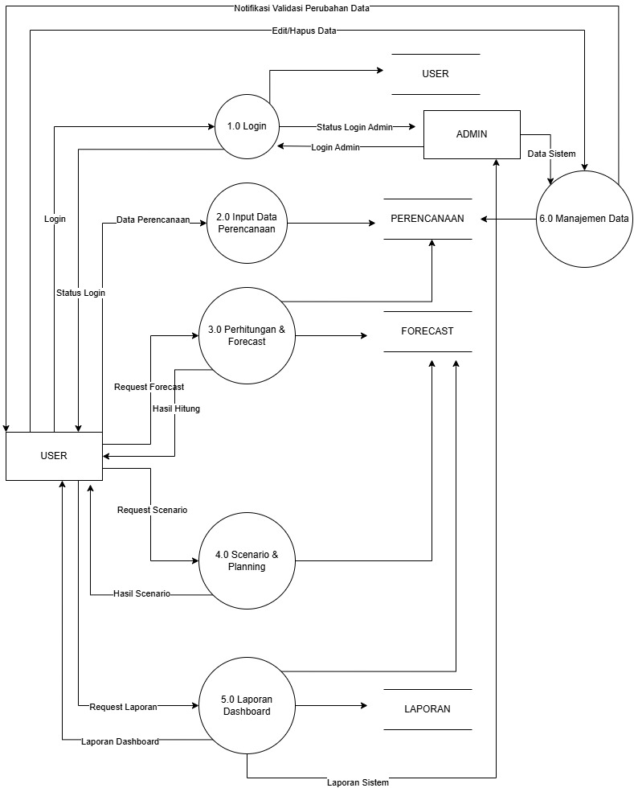
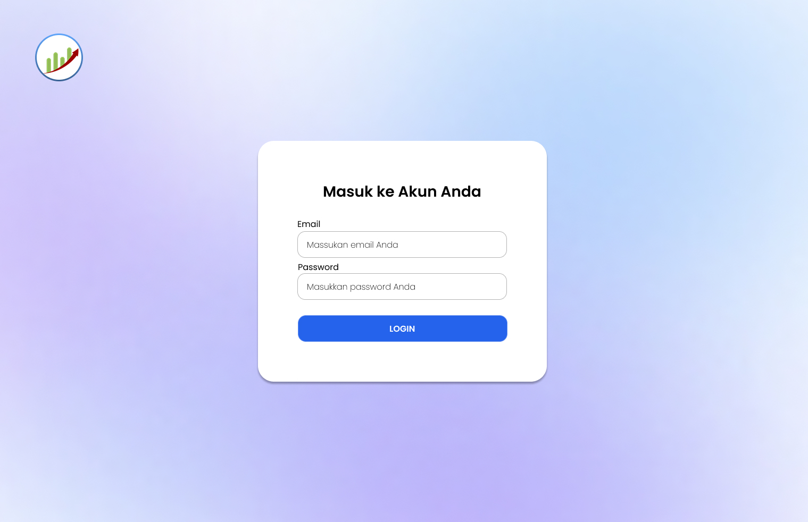
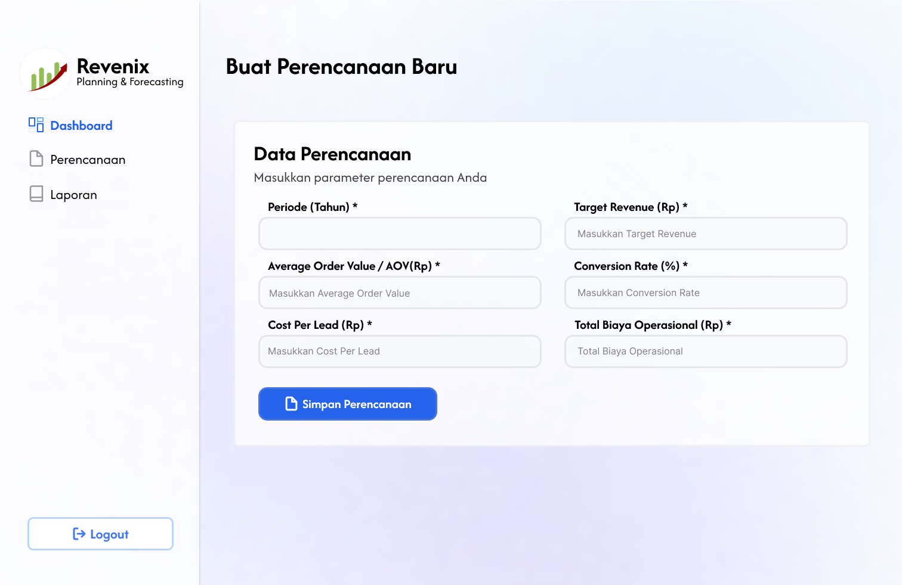

# 🚀 Tugas Besar: Revenix-Plan-Better-Earn-Better

> **Dosen Pengampu:** Muhammad Shiddiq Azis, S.T., MBA

---

## 📊 Perancangan Sistem (DFD)

### Class Diagram

### DFD Level 0

Pada diagram ini terdapat dua entitas yaitu user dan admin. User dapat melakukan login, menginput data perencanaan, meminta proses forecasting, serta melihat laporan yang dihasilkan oleh sistem. Respon dari sistem yaitu memberikan keluaran berupa status login, hasil perencanaan, hasil forecasting, dan data laporan.Selain itu, Admin berperan dalam mengelola sistem. Admin dapat melakukan login serta mengelola data yang ada di dalam sistem. Sistem kemudian memberikan keluaran berupa status login admin dan laporan sistem.

### DFD Level 1

Pada diagram ini, sistem diuraikan menjadi beberapa proses yaitu proses login, input data perencanaan, perhitungan dan forecasting, scenario & planning, laporan dashboard, serta manajemen data. Ada beberapa proses pada gambar yang dibagi menjadi 6 proses:
- Proses 1.0 Login digunakan oleh user maupun admin untuk masuk ke dalam sistem dengan memasukkan data login. Sistem kemudian memverifikasi data tersebut dan memberikan keluaran berupa status login.
- Proses 2.0 Input Data Perencanaan memungkinkan user untuk memasukkan data perencanaan ke dalam sistem yang selanjutnya disimpan sebagai data perencanaan.
- Proses 3.0 Perhitungan & Forecast digunakan untuk melakukan proses perhitungan dan menghasilkan hasil forecasting berdasarkan data yang telah dimasukkan sebelumnya.
- Proses 4.0 Scenario & Planning memungkinkan user untuk melakukan simulasi atau skenario perencanaan berdasarkan hasil forecasting sehingga dapat membantu dalam pengambilan keputusan.
- Proses 5.0 Laporan Dashboard berfungsi untuk menampilkan laporan yang dihasilkan sistem sehingga user dapat melihat ringkasan data perencanaan, forecasting, maupun hasil skenario.
- Proses 6.0 Manajemen Data yang dilakukan oleh admin untuk mengelola data sistem seperti menambah, mengubah, atau menghapus data sehingga sistem tetap terkelola dengan baik.

---

## 🎨 Mockup Antarmuka
Rancangan UI aplikasi yang berfokus pada pengalaman pengguna.

| Login Page | Dashboard | Core Feature |
| :---: | :---: | :---: |
|  |  |  |

---

## 🛠️ Stack Teknologi
- **Frontend:** React.js
- **Backend:** Python 
- **Database:** Firebase

---

## 📂 Cara Instalasi
1. `git clone [url-repo]`
2. `npm install` (atau sesuaikan dengan environment)
3. `npm run dev`
